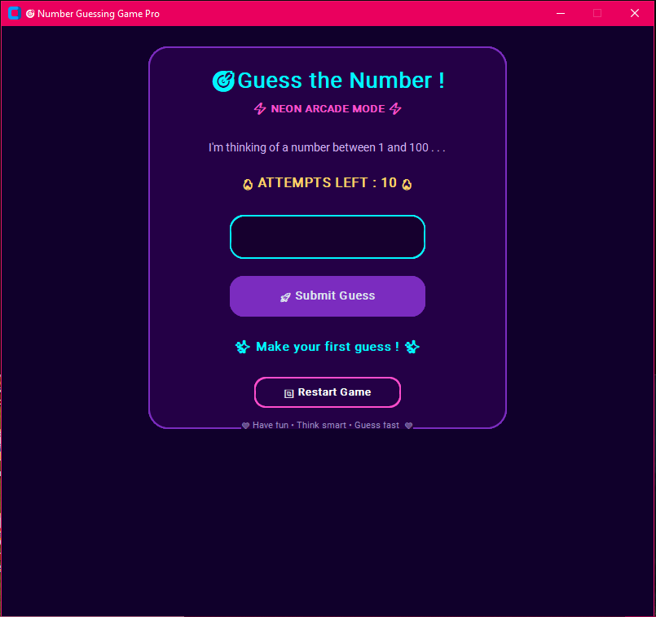

# 🎯 Number Guessing Game

A colourful and interactive **Number Guessing Game** built using **Python** and **CustomTkinter**.

The player has to guess a randomly generated number between **1 and 100** within a limited number of attempts.

## ✨ Features

- 🎯 Random number generation
- 🔢 Number range from 1 to 100
- 🔥 Maximum 10 attempts
- 📈 Too High / Too Low hints
- 🏆 Winning message
- 💀 Game Over message
- 🔄 Restart Game option
- ⌨️ Enter key support
- 🎨 Colourful and modern GUI
- ✨ Emoji-based interface

## 🛠️ Technologies Used

- **Python**
- **CustomTkinter**

## 📂 Project Structure

Number-Guessing-Game/
│
├── Guessing game.py
├── requirements.txt
└── README.md

## ⚙️ Installation

Clone the repository:
git clone https://github.com/your-username/number-guessing-game.git

Move into the project folder:
cd number-guessing-game

Install the required packages:
pip install -r requirements.txt

## ▶️ How to Run

Run the following command:
python Guessing game.py

## 🎮 How to Play

1. Start the game.
2. Enter a number between **1 and 100**.
3. Click **Submit Guess** or press **Enter**.
4. The game will tell you whether your guess is:
   - 📈 Too High
   - 📉 Too Low
   - 🎉 Correct
5. You have **10 attempts** to find the number.
6. Use **Restart Game** to start a new round.

## 📸 Preview

Add a screenshot of your game here:

## 👩‍💻 Author

**Aadhya Srivastava**

---

⭐ If you like this project, consider giving it a star!